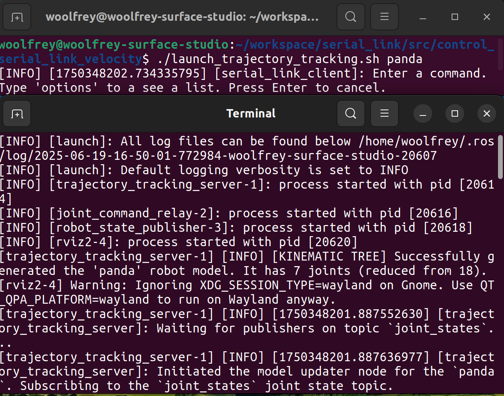
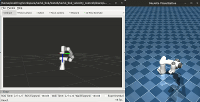

<a id="top"></a>
# 🎛️ Serial Link Velocity Control

This repository contains a ROS2 package with various configuration & launch files for controlling serial link robot arms in velocity mode. It is an extension of the [Kuka velocity control package](https://github.com/Woolfrey/control_kuka_velocity) that now enables multiple models:
- The Kuka iiwa14,
- The Franka Panda,
- The Rethink Robotics Sawyer, and
- The Universal Robot UR10.

<p align="center"/>
  
  
  
  
</p>

It uses the [serial_link_action_client](https://github.com/Woolfrey/client_serial_link) to send goals to the [serial_link_action_server](https://github.com/Woolfrey/server_serial_link). The latter implements [RobotLibrary](https://github.com/Woolfrey/software_robot_library) for the real-time control algorithms. It is designed to interact with the [mujoco_ros2](https://github.com/Woolfrey/mujoco_ros2) package for simulation, but you can easily swap this out for a real robot provided you establish the correct communication channels.

This package primarily serves as an example of how to implement the [serial_link_action_client](https://github.com/Woolfrey/client_serial_link) and [serial_link_action_server](https://github.com/Woolfrey/server_serial_link) packages to control a robot arm. You can fork it, and modify it, to get it running for any other robot arm, provided you have a valid URDF 🦾

:sparkles: Features include:
- Joint & Cartesian trajectory tracking,
- Real-time velocity control of the endpoint with a joystick,
- Real-time control of the endpoint with an interactive marker in RViz,
- Configuration files to rapidly change preset joint positions, endpoint poses, etc.

The diagram below shows how all the components interact:

<p align="center">
  
</p>

#### :compass: Navigation
- [Requirements](#clipboard-requirements)
- [Installation](#floppy_disk-installation)
- [Configuration Files](#gear-configuration-files)
- [Launch Files](#rocket-launch-files)
- [Contributing](#handshake-contributing)
- [Citing this Repository](#bookmark_tabs-citing-this-repository)
- [License](#scroll-license)

## :clipboard: Requirements

> [!NOTE]
> This package was built and tested using Ubuntu 22.04, ROS2 Humble, and MuJoCo 3.2.0.

- [Ubuntu 22.04](https://ubuntu.com/blog/tag/22-04-lts), or later,
- [ROS2 Humble](https://docs.ros.org/en/humble/index.html), or later, the
- The [serial link interfaces](https://github.com/Woolfrey/interface_serial_link) package,
- The [serial_link_action_server](https://github/com/Woolfrey/server_serial_link) package,
- The [serial_link_action_client](https://github/com/Woolfrey/client_serial_link) package,
- [Robot Library](https://github.com/Woolfrey/software_robot_library) (for the serial link action server),
- The [mujoco_ros2](https://gitub.com/Woolfrey/mujoco_ros2) (optional),
- [MuJoCo Menagerie](https://github.com/google-deepmind/mujoco_menagerie) (if using the mujoco_ros2 package),

[:top: Back to Top.](#top)

## :floppy_disk: Installation

Download and install all the necessary packages listed above. Your directory structure should end up looking something like this:

```
workspace/
├── software_robot_library/
├── mujoco_menagerie/
└── ros2_ws/
    ├── build/
    ├── install/
    ├── log/
    └── src/
        ├── client_serial_link/
        ├── control_serial_link_velocity/
        ├── interface_serial_link/
        ├── mujoco_ros2/ (optional)
        └── server_serial_link/
```

[:top: Back to Top.](#top)

## :gear: Configuration Files

Inside the `config/` directory are all the configuration files to change parameters & performance of the controller.

| File | Description |
|------|-------------|
| `config/control_parameters.yaml` | Contains variables like feedback gains, control frequency, and parameters for the QP solver. |
| `config/tolerances.yaml` | Contains maximum permissable errors in position, velocity tracking. The action servers will abort when violated. |
| `config/wii_nunchuck.yaml` | Used by the `follow_twist` action. It specifies button mapping for manually controlling the speed of the endpoint. |
| `config/<robot_model>/endpoint_poses.yaml` | Pre-defined Cartesian poses that can be used to generate Cartesian trajectories, and are called by name in the client. |
| `config/<robot_model>/joint_configurations.yaml` | Pre-defined joint positions use for moving the robot between different configurations. They are called by name in the client. |

You can play around with them and see how they work.

[:top: Back to Top.](#top)

## :rocket: Launch Files

> [!NOTE]
> I use bash scripts to simultaneously run the action client, and launch the action server. You need to run the client (instead of launch) so that its possible to type commands in to the terminal.

There are 3 bash script you can run. From the `control_serial_link_velocity/` directory you can run:
- `./launch_follow_transform.py <robot_model>` to move the robot around with an interactive marker,
- `./launch_follow_twist.py <robot_model>` to move the robot around with joystick, or
- `./launch_trajectory_tracking.py <robot_model>` to run the Cartesian trajectory.

`<robot_model>` is an argument that is either:
- `iiwa14`,
- `panda`,
- `sawyer`, or
- `ur10e`.

The client will launch in your current terminal. Another terminal will open up for the action server.

<p align="center">
  
</p>

### mujoco.py

If you don't have a real robot, you can use this [MuJoCo simulation](https://github.com/Woolfrey/mujoco_ros2). Inside the `launch/mujoco.py` file you need to specify where MuJoCo Menagerie is located:

```
    mujoco_menagerie_directory = "directory/for/mujoco_menagerie"
```

Open a terminal, and run `ros2 launch serial_link_velocity_control mujoco.py model:=<model_name>` and it should start. Again, the options for `<model_name>` are:
- `iiwa14`,
- `panda`,
- `sawyer`, or
- `ur10e`

You should also see the joint states being published, and the joint command topic ready to control the robot:

<p align = "center">
  
</p>

### Following a Transform

This action server solves the real-time Cartesian velocity control to enable the robot to follow a desired `tf2:transform`. It uses an interactive marker within Rviz, from the `serial_link_interfaces` repository which as the `interactive_marker` node. But you can set up the action server to follow any transform, such as following an object in real time.

You run it with:
```
./launch_follow_transform.sh <model_name>
```
and the relevant action clients & servers will start up.

In the client terminal:
1. Type `ready` to move the robot in to the ready configuration,
2. Move the interactive marker in the RViz window somewhere close to the robot end-effector transform, and
3. Type `follow` in the client terminal.

You should be able to drag around the interactive marker and the robot will automatically follow.

<p align="center">
  
</p>

### Following a Velocity Command (Twist)

This action server enables you to command the endpoint velocity in real time, using a twist (linear & angular velocity). In this demo, it launches a ROS2 `joy` node, and the `joy_twist_mapper` node from `serial_link_interfaces`. But you can modify the goal sent from the client to follow any `geometry_msgs::msg::TwistStamped` topic.

```
./launch_follow_twist.sh <model_name>
```
and the relevant action clients & servers will start up.

In the client terminal:
1. Type `ready` to move the robot in to the ready configuration,
2. Type `follow` in the client terminal.

When a joystick is plugged in, certain joystick and button commands will move the robot. You can change the joystick mapping in the `config/wii_nunchuck.yaml` file, or write your own.

<p align="center">
  
</p>

### Cartesian Trajectory Tracking

This enables Cartesian trajectory tracking using the waypoints specified in the `endpoint_poses.yaml` file. You can start it up with:

```
./launch_track_trajectory.sh <model_name>
```

This will start up the clients & servers for both joint & Cartesian velocity control:
1. Type `ready` to move the robot to the start configuration.
2. Try commands like `up`, `down`, `left`, `right`, etc. to move the endpoint of the robot in different directions.

Type `options` to see what is available.

<p align="center">
  
</p>

[:top: Back to Top.](#top)

## :handshake: Contributing

Contributions to this repositore are welcome! Feel free to:
1. Fork the repository,
2. Implement your changes / improvements, then
3. Issue a pull request.

If you're looking for ideas, you can always check the [Issues tab](https://github.com/Woolfrey/control_kuka_velocity/issues) for those with :raising_hand: [OPEN]. These are things I'd like to implement, but don't have time for. It'd be much appreciated, and you'll be tagged as a contributor :sunglasses:

[:top: Back to Top.](#top)
## :bookmark_tabs: Citing this Repository

If you find this code useful, spread the word by acknowledging it. Click on `Cite this repository` under the **About** section in the top-right corner of this page :arrow_upper_right:.

Here's a BibTeX reference:
```
@software{woolfrey_kuka_velocity_control_2025,
     author  = {Woolfrey, Jon},
     month   = june,
     title   = {{S}erial {L}ink {V}elocity {C}ontrol},
     url     = {https://github.com/Woolfrey/control_serial_link_velocity},
     version = {1.0.0},
     year    = {2025}
}
```

[:top: Back to Top.](#top)

## :scroll: License

This software package is licensed under the [GNU General Public License v3.0 (GPL-3.0)](https://choosealicense.com/licenses/gpl-3.0/). You are free to use, modify, and distribute this package, provided that any modified versions also comply with the GPL-3.0 license. All modified versions must make the source code available and be licensed under GPL-3.0. The license also ensures that the software remains free and prohibits the use of proprietary restrictions such as Digital Rights Management (DRM) and patent claims. For more details, please refer to the [full license text](LICENSE).

[:top: Back to Top.](#top)
