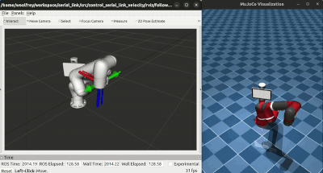
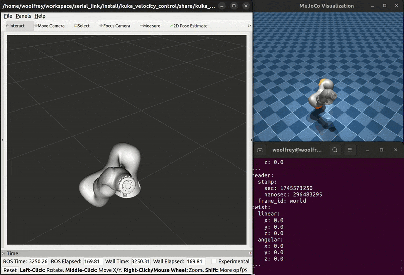

# :joystick: Kuka Velocity Control

This package contains launch files for several nodes, action servers, and action clients to enable joint & Cartesian velocity control of the Kuka iiwa14 robot. It uses the [serial_link_action_client](https://github.com/Woolfrey/client_serial_link) package to send goals to the [serial_link_action_server](https://github/com/Woolfrey/server_serial_link). The latter implements [Robot Library](https://github.com/Woolfrey/software_robot_library) which is a C++ library for modeling & control. It can also interact with the [mujoco_ros2](https://github.com/Woolfrey/mujoco_ros2) package to for simulation.

In essence, it serves as an example of how to implement the [serial_link_action_client](https://github.com/Woolfrey/client_serial_link) package to send goals to the [serial_link_action_server](https://github/com/Woolfrey/server_serial_link) to control a robot arm, with all the necessary config files. You can copy and/or modify it to get it working for other robot arms :mechanical_arm:.

:sparkles: Features:
- Joint & Cartesian trajectory tracking,
- Real-time velocity control of the endpoint with a joystick,
- Real-time control of endpoint pose with an interactive marker in RViz.

<p align="center">
  
</p>

#### :compass: Navigation
- [Requirements](#clipboard-requirements)
- [Installation](#floppy_disk-installation)
- [Configuration Files](#gear-configuration-files)
- [Launch Files](#rocket-launch-files)
- [Release Notes](#package-release-notes---v100-april-2025)
- [Contributing](#handshake-contributing)
- [Citing this Repository](#bookmark_tabs-citing-this-repository)
- [License](#scroll-license)

## :clipboard: Requirements

- [Ubuntu 22.04](https://ubuntu.com/blog/tag/22-04-lts), or later,
- [ROS2 Humble](https://docs.ros.org/en/humble/index.html), or later, the
- The [serial link interfaces](https://github.com/Woolfrey/interface_serial_link) package,
- The [serial_link_action_server](https://github/com/Woolfrey/server_serial_link) package,
- The [serial_link_action_client](https://github/com/Woolfrey/client_serial_link) package,
- [Robot Library](https://github.com/Woolfrey/software_robot_library) (for the serial link action server),
- The [mujoco_ros2](https://gitub.com/Woolfrey/mujoco_ros2) (optional),
- [MuJoCo Menagerie](https://github.com/google-deepmind/mujoco_menagerie) (if using the mujoco_ros2 package),

> [!NOTE]
> This package was built and tested using Ubuntu 22.04, ROS2 Humble, and MuJoCo 3.2.0.

[:top: Back to Top.](#joystick-kuka-velocity-control)

## :floppy_disk: Installation

Your directory structure should end up looking something like this:
```
workspace/
├── software_robot_library/
├── mujoco_menagerie/
└── ros2_ws/
    ├── build/
    ├── install/
    ├── log/
    └── src/
        ├── client_serial_link/
        ├── control_kuka_velocity/
        |   ├── config/
        |   ├── doc/
        |   ├── include/
        |   ├── launch/
        |   ├── rviz/
        |   ├── src/
        |   ├── urdf/
        |   ├── CMakeLists.txt
        |   ├── LICENSE
        |   ├── package.xml
        |   └── README.md
        ├── interface_serial_link/
        ├── mujoco_ros2/
        └── server_serial_link/
```

Download and install all the necessary packages.

[:top: Back to Top.](#joystick-kuka-velocity-control)

## :gear: Configuration Files

Inside the `config/` directory are all the configuration files to change parameters & performance of the controller:
- `control_parameters.yaml` contains things like feedback gains used by the underlying `RobotLibrary::Control` classes.
- `iiwa_endpoint_poses.yaml` specifies waypoints for Cartesian trajectories, which is loaded by the `trajectory_tracking_client` node.
- `iiwa_joint_configurations.yaml` specifies waypoints for joint trajectories, loaded by the `TrackJointTrajectory` action client.
- `tolerances.yaml` contains maximum permissable errors for things like trajectory tracking, etc. The action server aborts if they are violated.
- `wii_nunchuck.yaml` specifies how to convert joystick inputs to Cartesian velocities used in the `joy_twist_mapper` node.

Play around with them and see how it works.

[:top: Back to Top.](#joystick-kuka-velocity-control)

## :rocket: Launch Files

> [!NOTE]
> I use bash scripts to simultaneously run the action client, and launch the action server. This is because the former allows you to type command prompts in to the terminal. This is not possible when you launch the client, instead of running.

### mujoco.py

If you don't have a real robot, you can use this MuJoCo simulation. Inside the `launch/mujoco.py` you need to specify the `xmlScenePath` where the model is located:

```
xmlScenePath = "/home/<username>/workspace/mujoco_menagerie/kuka_iiwa_14/scene.xml"
```

Open a terminal, and run `ros2 launch kuka_velocity_control mujoco.py` and it should start. You should also see the joint states being published, and the joint command topic ready to control the robot:

<p align = "center">
  
</p>

### launch_follow_transform.sh

Inside the `control_kuka_velocity/` directory, type:
```
./launch_follow_transform.sh
```
and the relevant action clients & servers will start up.

In the client terminal:
1. Type `ready` to move the robot in to the ready configuration,
2. Move the interactive marker in the RViz window somewhere close to the robot end-effector transform, and
3. Type `follow` in the client terminal.

You should be able to drag around the interactive marker and the robot will automatically follow.

<p align="center">
  
</p>

### launch_follow_twist.sh

Inside the `control_kuka_velocity/` directory, type:
```
./launch_follow_twist.sh
```
and the relevant action clients & servers will start up.

In the client terminal:
1. Type `ready` to move the robot in to the ready configuration,
2. Type `follow` in the client terminal.

A `joy` node is automatically run, and a `joy_twist_mapper` node (from the interface package). If you plug in a game controller or joystick, you can manually control the endpoint of the robot :joystick:.

You can change the joystick mapping in the `config/wii_nunchuck.yaml` file.

<p align="center">
  
</p>

### launch_trajectory_tracking.sh

From the `control_kuka_velocity/` directory type this in to a terminal:

```
./launch_track_trajectory.sh
```

This will start up the clients & servers for both joint & Cartesian velocity control:
1. Type `ready` to move the robot to the start configuration.
2. Try commands like `up`, `down`, `left`, `right`, etc. to move the endpoint of the robot in different directions.

Type `options` to see what is available.

<p align="center">
  
</p>

[:top: Back to Top.](#joystick-kuka-velocity-control)

## :package: Release Notes - v1.0.0 (April 2025)

### :tada: First Release:
- Implements `FollowTransform`, `FollowTwist`, `TrackCartesianTrajectory`, and `TrackJointTrajectory` actions.
- Enables joystick control of robot endpoint,
- Enables pose control with interactive marker, and
- Config files for changing control parameters.

[:top: Back to Top.](#joystick-kuka-velocity-control)

## :handshake: Contributing

Contributions to this repositore are welcome! Feel free to:
1. Fork the repository,
2. Implement your changes / improvements, then
3. Issue a pull request.

If you're looking for ideas, you can always check the [Issues tab](https://github.com/Woolfrey/control_kuka_velocity/issues) for those with :raising_hand: [OPEN]. These are things I'd like to implement, but don't have time for. It'd be much appreciated, and you'll be tagged as a contributor :sunglasses:

[:top: Back to Top.](#joystick-kuka-velocity-control)

## :bookmark_tabs: Citing this Repository

If you find this code useful, spread the word by acknowledging it. Click on `Cite this repository` under the **About** section in the top-right corner of this page :arrow_upper_right:.

Here's a BibTeX reference:
```
@software{woolfrey_kuka_velocity_control_2025,
     author  = {Woolfrey, Jon},
     month   = apr,
     title   = {{K}uka {V}elocity {C}ontrol},
     url     = {https://github.com/Woolfrey/control_kuka_velocity},
     version = {1.0.0},
     year    = {2025}
}
```
Here's the automatically generated APA format:
```
Woolfrey, J. (2025). Kuka Velocity Control (Version 1.0.0). Retrieved from https://github.com/Woolfrey/control_kuka_velocity
```

[:top: Back to Top.](#joystick-kuka-velocity-control)

## :scroll: License

This software package is licensed under the [GNU General Public License v3.0 (GPL-3.0)](https://choosealicense.com/licenses/gpl-3.0/). You are free to use, modify, and distribute this package, provided that any modified versions also comply with the GPL-3.0 license. All modified versions must make the source code available and be licensed under GPL-3.0. The license also ensures that the software remains free and prohibits the use of proprietary restrictions such as Digital Rights Management (DRM) and patent claims. For more details, please refer to the [full license text](LICENSE).

[:top: Back to Top.](#joystick-kuka-velocity-control)
